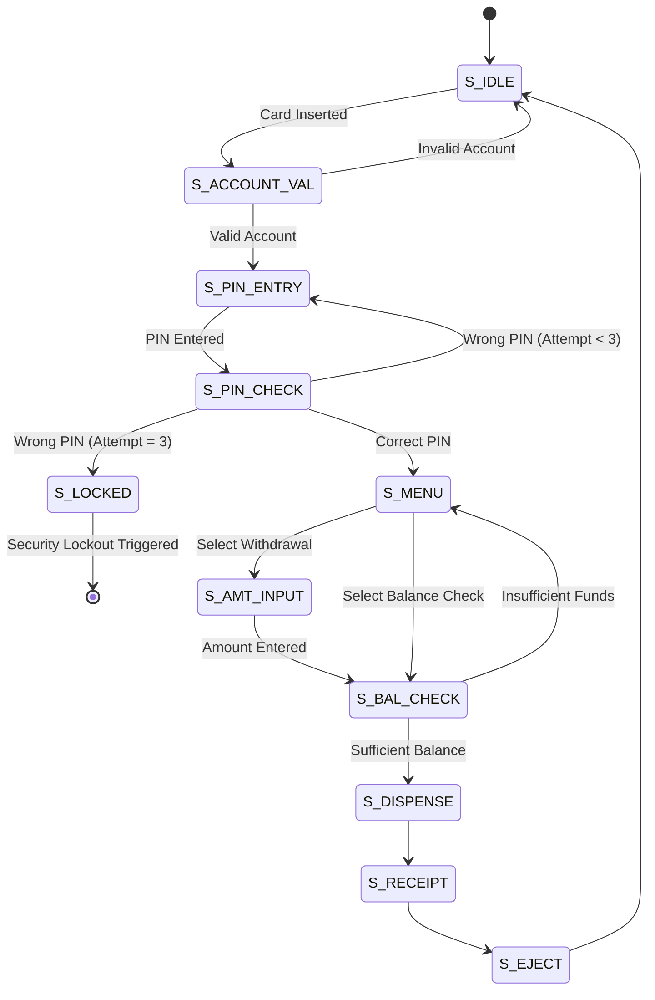

ATM Transaction Workflow — Verilog Simulation

## 🚀 Quick Start — One Command!

```bash
make start
```

That's it! The script will:
- ✅ Install dependencies
- ✅ Start Flask backend (port 5000)
- ✅ Start frontend server (port 8000)

**Open browser:** http://127.0.0.1:8000

**Demo Credentials:**
- Account: `1234`
- PIN: `9`

Press `Ctrl+C` to stop.

---

## Project Structure

Purpose
- Small, interview-friendly RTL project that demonstrates implementing an
  FSM in Verilog, a deterministic Verilog testbench, and a state-aware cocotb
  fuzzer. It's useful for talking about design choices, test strategies, and
  verification trade-offs in interviews (timing, state encoding, Mealy vs
  Moore outputs, security/lockout logic).

Why this repo is useful in interviews
- Clear, focused code in `atm_fsm.v` for walking through state transitions and
  reasoning about corner cases (lockout, insufficient funds, withdraw limits).
- A native Verilog testbench (`atm_tb.v`) suitable for deterministic test
  scenarios and quick demos.
- A cocotb fuzzer (`test_atm_fuzzer.py`) showing modern verification with
  Python for more advanced test automation (optional to run).
- An **interactive HTML/JS+Python backend** that drives the Verilog DUT in real-time so users feel they are using an ATM while actually exercising the design.

Quick-start
-----------

1. Run the native simulation (recommended for interviews):

```bash
make native
```

or:

```bash
./sim/run_native.sh
```

The waveform is written to `sim/atm_waves.vcd`.

2. Run the simulation:

```bash
make test   # runs the native scenarios
```

3. Clean build artifacts:

```bash
make cleanlocal
```

4. Open the waveform:

```bash
gtkwave atm_waves.vcd
```

Next steps for interview polish
- Convert a couple of scenarios in `atm_tb.v` into cocotb unit tests to show
  a shift from deterministic tests to automated verification with assertions.
- Add a short `NOTES.md` summarising potential improvements and known
  limitations you can discuss in interviews (e.g. persistence across resets,
  multi-account handling, concurrency).

Project files (kept minimal)
- `atm_fsm.v` — RTL FSM (core)
- `atm_tb.v` — native Verilog testbench (deterministic scenarios)
- `app.py` — Flask backend that runs simulations on user actions
- `atm_app.js` — Frontend ATM UI that calls the backend
- `index.html` — Interactive ATM webpage interface
- `test_atm_fuzzer.py` — optional cocotb fuzz test for advanced verification
- `Makefile` — `make test`, `make native`, `make backend`, `make serve`, etc.
- `.github/workflows/ci.yml` — CI runs `make test` and uploads waveform



# ATM Transaction Workflow - FSM Project

A comprehensive hardware-level simulation of an Automated Teller Machine (ATM) using a 12-state Finite State Machine (FSM). This project bridges the gap between low-level Verilog logic and high-level interactive visualization.

## 🚀 Features
- *Multi-State Security*: Implements a complex 12-state FSM for robust transaction handling.
- *Authentication*: Validates 16-bit account numbers and 4-bit PINs.
- *Security Lockout*: Real-time tracking of failed attempts with a permanent S_LOCKED state after 3 failures.
- *Hardware-Level Constraints*: Validates balance registers and withdrawal increments (multiples of 10).
- *Hybrid Simulation*: Verilog logic verified via GTKWave testbenches alongside an interactive HTML/CSS/JS functional simulator.

## SIMPLY 
 [ THE TESTBENCH ROBOT ]                        [ YOUR ATM CHIP (DUT) ]
  
  reg clk ---------(Pushes electricity)---------> input wire clk
  reg pin_in ------(Pushes electricity)---------> input wire pin_in
  
  wire balance_out <---(Passively listens)------- output reg balance_out
  wire locked_out  <---(Passively listens)------- output reg locked_out
